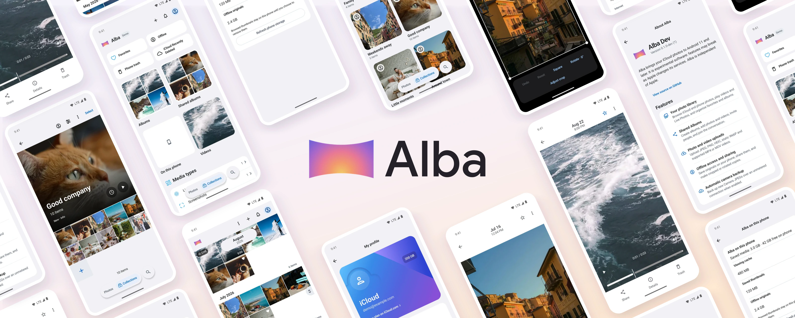

Your iCloud photos, on Android.

Alba is free and open source, with optional donations. No subscriptions or paid features.

**Still experimental.** It uses unofficial Apple APIs, so things can break when Apple changes them. Not affiliated with Apple.

Android 11+. English and Italian.

## Features

- [x] Sign in to iCloud with two-factor authentication
- [x] Browse your iCloud photos and the photos on your phone
- [x] Watch videos and Live Photos
- [x] Search by filename, filter by date, and sort your library
- [x] Use albums, favorites and Shared Albums
- [x] Crop and rotate photos, then save an edited copy
- [x] Save originals offline or to your phone, and share them with other apps
- [x] Upload JPEG, PNG, HEIC, static WebP and H.264/HEVC videos in MP4 or MOV files
- [x] Automatically back up new JPEG photos from your camera over an unmetered connection

## Next

- [ ] Automatic backup for videos and more photo formats
- [ ] Choose which folders to back up
- [ ] Include older photos in backups, with a size estimate before starting
- [ ] Play Store release

iCloud Shared Photo Library isn't supported. It's different from Shared Albums, which are supported.

## How it works

Alba talks directly to Apple using the web APIs behind iCloud. Your photos don't pass through a Alba server.

It keeps a local catalog and downloaded previews on your phone, so you can still browse those when you're offline. Full-size originals are downloaded when you need them. You can also choose to keep them offline.

Your password and verification codes aren't saved. Your sign-in session is stored encrypted on your phone. See [Privacy](PRIVACY.md) for the details, including optional crash reporting.

## Build

Use JDK 21 and Android SDK 37 with build tools 37.0.0. Set `JAVA_HOME` and `ANDROID_SDK_ROOT`, then run:

```sh
./gradlew :app:assembleDebug testDebugUnitTest lintDebug
```

APKs are in `app/build/outputs/apk/`. `:app:assembleRelease` produces an unsigned release unless local signing is configured.

## Releases

The website deploys from `main`. App versions are prepared in GitHub Actions, tested internally, then promoted without rebuilding. See [release instructions](RELEASING.md).

## Tests

CI runs device tests on Android 11 and 16. Locally, create a native Android emulator in Android Studio, then run `MELA_AVD_NAME=your_avd scripts/run_android_tests.sh`. On a Mac, the script requires and checks hardware graphics.

For performance work, set `ANDROID_SERIAL` to your test device. Run `scripts/benchmark_android.sh profile` to update the Baseline Profile, then `scripts/benchmark_android.sh measure` on a physical phone. These use a separate app with demo photos. The older emulator measurement script is only a smoke check.

## Contribute

Found a bug or have an idea? [Open an issue](https://github.com/thisislvca/alba/issues). Pull requests are welcome too, under the same AGPL-3.0-only license.

Please leave passwords, account data and personal photos out of reports. For security problems, use [private reporting](SECURITY.md).

## License

[AGPL-3.0-only](LICENSE). See [third-party credits and licenses](THIRD_PARTY_NOTICES.md).
